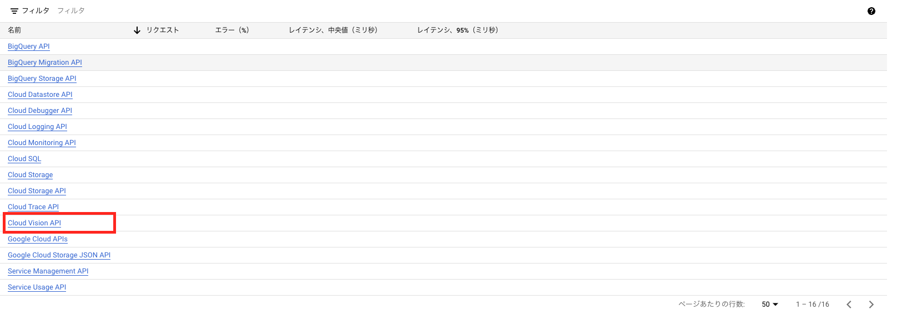
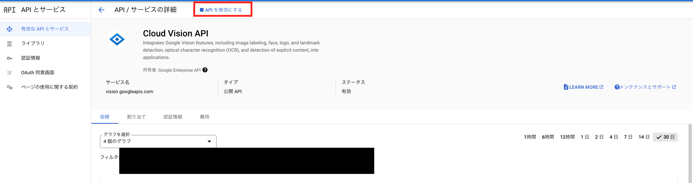
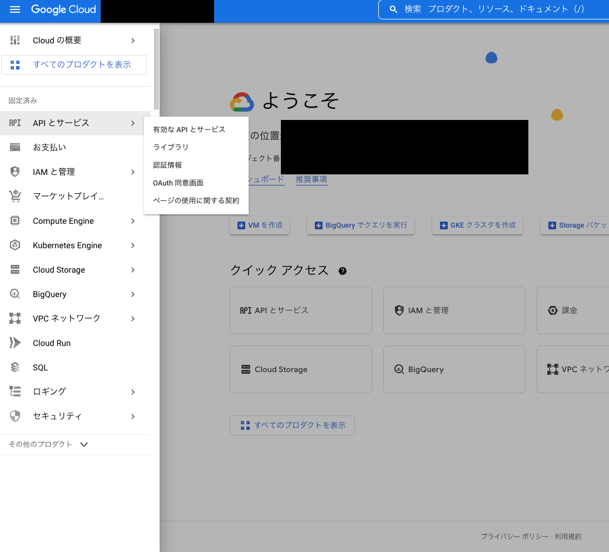
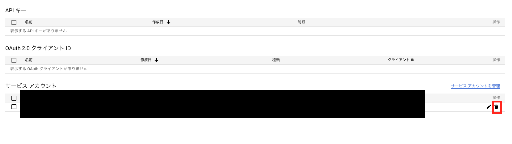


  

  


最終更新日:{{ lastmod }}
アプリの正常な動作を確認したら後片付けを行います。不本意な請求が来ないよう必ず実施しましょう。もし、今後使う可能性があったとしてもまた構築しなおせばいいので削除してしまいましょう。

### Google Cloud コンソール画面の起動

下記URLより、コンソール画面を開いてください。

[https://console.cloud.google.com/welcome?project=streamlit-ai-app&hl=ja]

### Cloud Vision APIの無効化
   
左上ハンバーガーメニューより`APIとサービス→有効なAPIとサービス`をクリックする。

サービス一覧から`Cloud Vision API`を選択する。

`APIを無効にする→無効にする`を選択する。

### 認証情報の削除
   
左上ハンバーガーメニューより`APIとサービス→認証情報`を選択

`サービスアカウント`の項目より、対象アカウントを選択し、
`ゴミ箱アイコン→削除`の順にクリック

ダイアログボックスの指示通りに操作を行い、`削除`をクリック

### ローカルのjsonファイルの削除

[Cloud Vision APIのセットアップ手順](setup_gcp.md)で保存したjsonファイルを削除してください。

後片付けは以上になります。お疲れ様でした。

[目次に戻る](./index.md)
