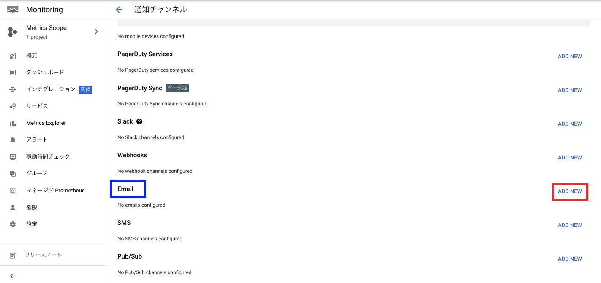


  

  


最終更新日:{{ lastmod }}

## Google Cloudの料金アラート設定について

### クラウドを使用することの注意点
多くのクラウドは従量課金制です。そのため、使い方によっては、オンプレミス環境で使うよりも初期投資を安く抑えることができます。
しかし、使い方を間違えることで思いがけぬ高額請求が来ることがあります。
このようなある種の事故は「クラウド破産」と表現されています。
クラウド破産の原因として以下のような例が挙げられます。
- 第三者のアクセスにより、不正な操作をされる。
- 自身の設定ミスで高額なオプションを設定したり、常に課金が発生したりする状態にしてしまう。

[^1]:筆者は以前、AWSのSageMakerというサービスで一日で7000円を溶かしました。

上記の被害を最小限に抑える対策の一例として、「金額が一定以上超えたら通知をする」といったものがあります。今回は、こちらをGCP上で構築していきます。

### 今回の実施内容
Google Cloudの「予算とアラート」機能を使い、利用料金の合計が一ヶ月で500円, 900円, 1000円を超えた場合に個人のメールアドレスに通知する設定を行います。
また、「Cloud Monitoring」というサービスで個人のメールアドレスへの通知設定を登録します。
なお、「予算とアラート」機能では、請求先アカウントとして、登録したメールアドレスに通知を行うこともでき、その場合はCloud Monitoringは不要です。今回は、複数のメールアドレスを持っている人もいることを考慮して、Cloud Monitoringを使用した方法を用います。

### 手順
1-6では、

1. Google Cloudの[コンソール](https://console.cloud.google.com/)にログインし、任意のプロジェクトにアクセスする。
2. 検索ボックスから「Monitoring」を選択する。

    
3. アラートを選択する。

    
4. 「EDIT NOTIFICATION CHANNELS」を選択する。

    
5. 「EMAIL」の項目の「ADD」を選択する。

    
6.  Email Addressのテキストボックスに自身のメールアドレスを入力する。  
    Display Nameはメールで通知するものであることが一目で分かる名称にする。(今回は「my_email」)とする。

    

1-6ではメールの通知設定を行いました。7以降では、予算の設定を行っていきます。

7. コンソールのトップページに戻り、左上のナビゲーションメニューから「お支払い」を選択する。

    
8. 「予算とアラート」を選択する。

    
9. 「予算を作成」を選択する。

    
10. 範囲の設定を行う。
    名前 : 「予算を1000円以内にしたい」ということが一目で分かるような名称にする。(今回は「under_1000」とする。)
    期間 : 「月別」になっているか確認する。
    プロジェクト : 予算を適用したいプロジェクトを選択する。今回は、プロジェクトが1つしかないので「すべてのプロジェクト(1個)」でよい。
    サービス : 今回は全体で1000円以下としたいため、「すべてのサービス（サービス数）」を選択する。
    クレジット：「割引」、「プロモーションなど」ともにチェックを入れたままにする。これにより、無料利用枠などが予算として算出されなくなる。

    以上の設定を確認後、「次へ」を押す。

    
11. 通知の管理を設定する。

    「課金管理者とユーザーに送信されるメールアラート」にチェックボックスを外す。
    「モニタリング メール通知チャネルをこの予算にリンクする」

    

[目次に戻る](./index.md)

