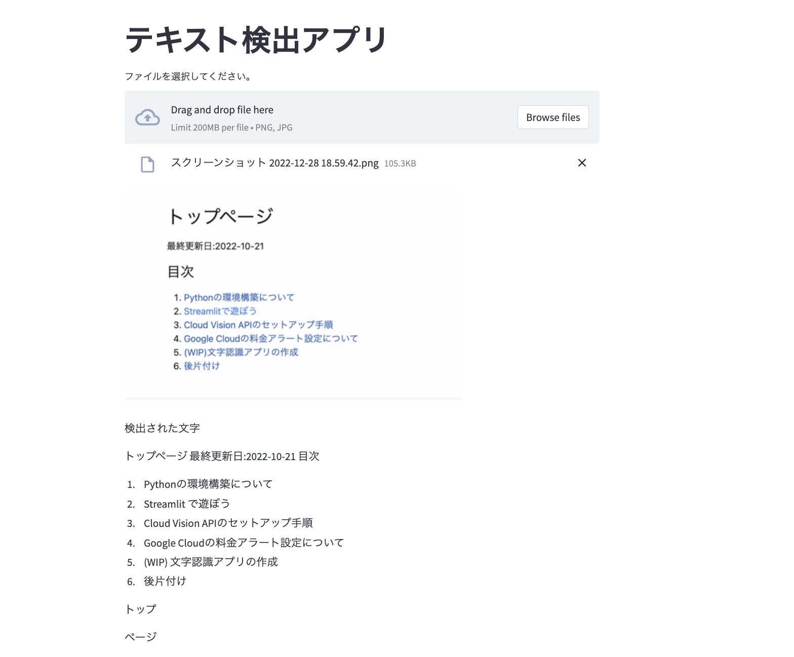


  

  


<span class="date">最終更新日:{{ lastmod }}</span>
※この記事は執筆中です。

Vision AIをとstreamlitを組み合わせて、簡単な文字認識アプリを作っていきます。

### 完成画面

以下のようにアプリ上にアップロードした画像に書かれた文字を検出するアプリを作ります。


### 手順
#### **Dockerfileの設定**
コンテナ起動時にstreamlitが起動し、ローカルホストからアプリを実行できるようにします。具体的には、以下のように編集しなおします。

```
FROM python:3.8

COPY . /opt/app

WORKDIR /opt/app

RUN pip install streamlit && \
    pip install --upgrade google-cloud-vision
RUN mkdir /tmp/keys/ && \
    touch /tmp/keys/key.json

# ↓不要
# RUN mkdir resources/ && wget https://4.bp.blogspot.com/-gX99oMun4bM/U9y_wYoE0EI/AAAAAAAAjiU/DHdcIfImCwQ/s800/pose_ganbarou_man.png -P /opt/app/resources/

ENV GOOGLE_APPLICATION_CREDENTIALS /tmp/keys/key.json

EXPOSE 8501

# ↓コメントアウトする。
# CMD ["bash"]

# いきなりstreamlitを立ち上げたいときはこちらを実行
ENTRYPOINT [ "streamlit", "run"]

CMD [ "src/app.py" ]
```

#### **ソースコードの作成**
`app.py`の中身を以下のように変更します。

```
import streamlit as st
from PIL import Image  # 画像表示に必要

from google.cloud import vision

# Vision APIの初期化
client = vision.ImageAnnotatorClient()

## タイトル
st.title("テキスト検出アプリ")

image_file = st.file_uploader("ファイルを選択してください。", type=["png", "jpg"])

if image_file is not None:
    image_byte_data = image_file.read()
    st.image(image_byte_data, width=500)  # byte型のデータも画像として表示できる。
    # image_byte_dataをvision API専用のImageクラスに変換する。
    image = vision.Image(content=image_byte_data)

    # テキスト検出APIを実行する。
    response = client.text_detection(image)
    texts = response.text_annotations

    st.write("検出された文字")
    for text in texts:
        st.write(text.description)
```

#### **Dockerコンテナの起動**
まず、`docker image build -t streamlit_study_img .`でDockerをビルドした後、以下のコマンドで、コンテナを起動します。

```
docker container run --name streamlit_study_container --mount type=bind,source="$(pwd)"/src,target=/opt/app/src -p 8501:8501 -v $GOOGLE_APPLICATION_CREDENTIALS:/tmp/keys/key.json:ro streamlit_study_img
```

### 完成!!
完成品と同じ画面になるはずです。自分の持っている文字付きの画像をアップロードしてうまく動くか確かめて見ましょう。

### 挙動がおかしい場合は
- ソースコードを見直してください。特に、Pythonはインデントが合っていないとエラーが発生するため、注意してください。
- streamlitのバージョンを確認してください。


[目次に戻る](./index.md)