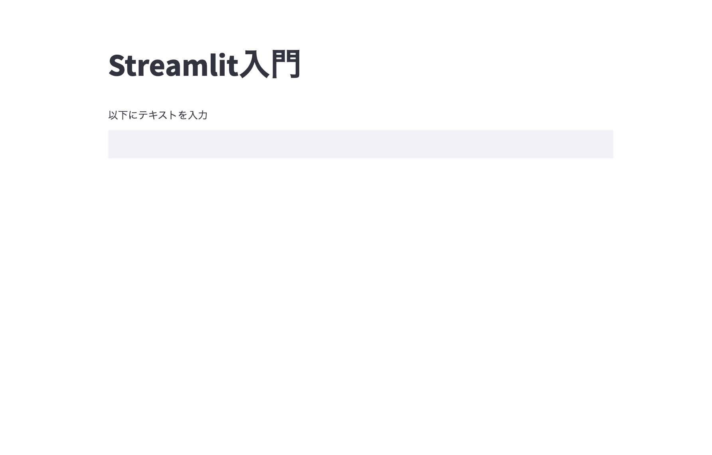

## Streamlitで遊ぼう

### 公式ドキュメントを読む
Streamlitの基本機能は全て、[公式のAPIリファレンス](https://docs.streamlit.io/library/api-reference)に記載されています。
プログラミングの開発ではドキュメント参照しながらコーディングしていく必要があるため、この機会に覚えておきましょう。

### Streamlitの機能
ここではStreamlitでよく使う機能について説明します。
#### st.text_input
いわゆるテキストボックスです。入力した文字を利用した制御ができます。

```
text = st.text_input("初期値")
st.write(f"テキストボックスの値 : {text}")
```

 

ただしこの状態だと、入力文字が空でも文字が出力されてしまいます。

 

そのため、if文を利用して出力させないようにするのがいいです。

```
text = st.text_input("以下にテキストを入力")

if text:
    st.write(f"テキストボックスの値 : {text}")
```

 

